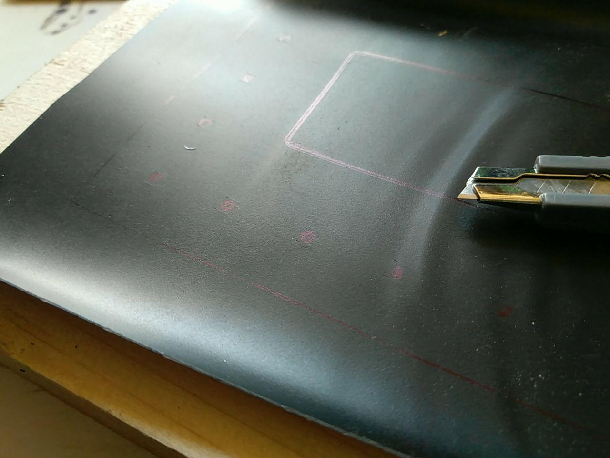
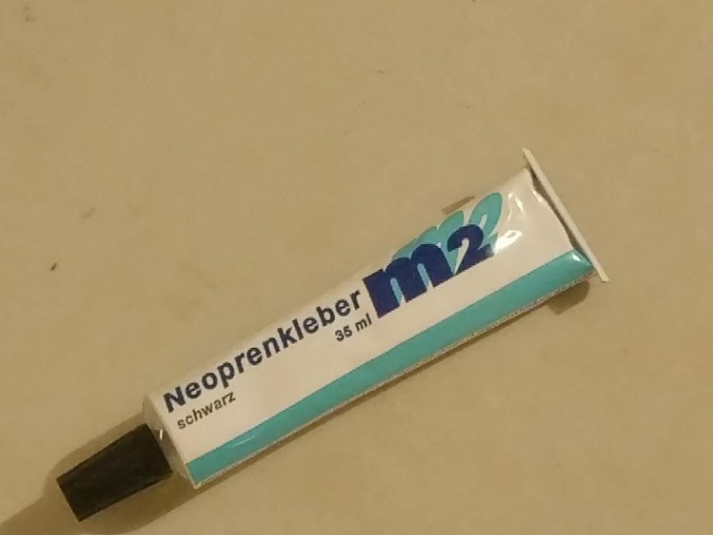

## Schritt 1 - Gehäuse vorbereiten

Fertige alle Kammerteile selbst mit einem Lasercutter oder beim Hobbyhimmel.

> Schönheitsfehler: Erstellt man die Verklebungen, entstehen beim Trocknen und zusammenpressen mittels Schrauben u. Muttern leichte Haarrisse, die jedoch keine weiteren Probleme verursachen. Man kann das vermeiden oder minimieren, indem man die Platten mit vier kleinen Bolzen zur Deckung bringt und dann mittels Zulagen und Zwingen den Anpressdruck erzeugt.

### Schritt 2 - Gummidichtung erstellen

Messe die Gummidichtung und passe sie ein in einem Stück.

Schneide außerdem die Zink-Anode zu.

Die eingeritzten Zahlen beinhalten das Gewicht. Damit kann man hinterher die Menge an umgesetzten Zink bestimmen.